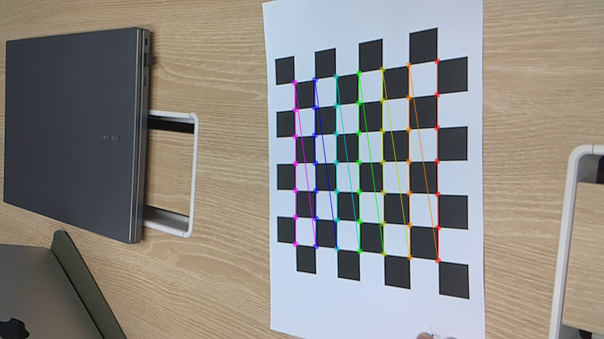

# 카메라 캘리브레이션

## 이미지 수집

- `collect_images.py` 이용
- s키를 눌러서 체크보드 촬영
- 10 ~ 20장 정도의 이미지 필요
- 체크보드의 내부 교차점 개수는 가로, 세로가 비대칭이어야 함

## 캘리브레이션



수식적으로 캘리브레이션은 다음과 같은 관계식을 푸는 과정입니다. $K$를 카메라 내부 파라미터(Intrinsic Matrix)라고 합니다. ($f_x, f_y$)는 렌즈의 초점 거리, ($c_x, c_y$)는 주점을 의미합니다.

$$
K = \begin{bmatrix}
f_x & 0 & c_x \\
0 & f_y & c_y \\
0 & 0 & 1
\end
{bmatrix}
$$

실제 측정값은 아래와 같습니다.

```
[[1.27657622e+03 0.00000000e+00 6.27885408e+02]
 [0.00000000e+00 1.28292572e+03 3.58350709e+02]
 [0.00000000e+00 0.00000000e+00 1.00000000e+00]]
```
